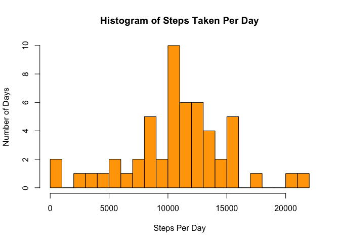
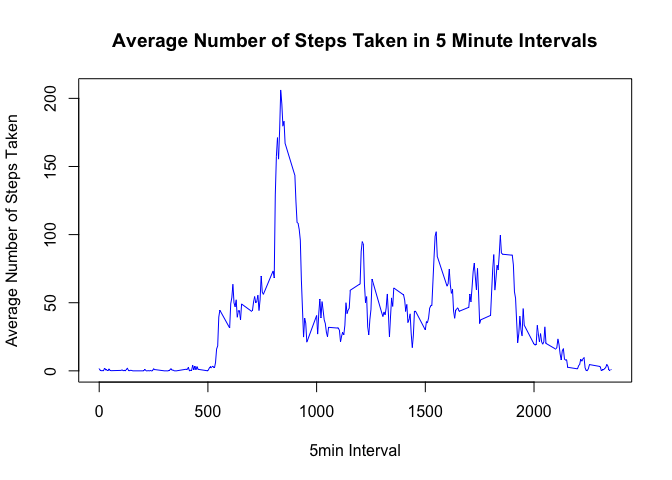
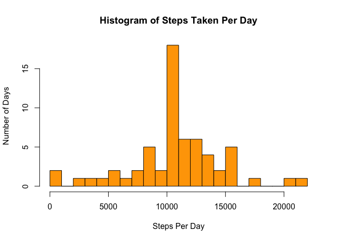
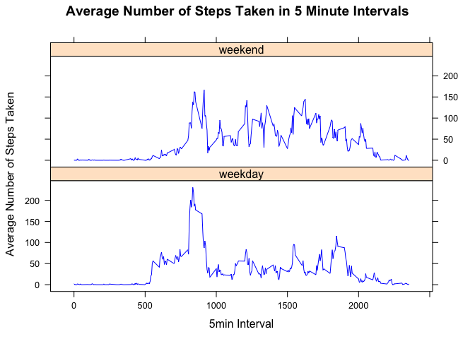

**Author:** André Felix Miertschink  
**Date:** 24/04/2020

## Library Requirements  
  
Loading the required libraries  


```r
library(lattice)
```

## Loading and preprocessing the data

### Loading the data

Try to find the data file (CSV) in current folder. If cannot be found, then try to find the compressed zip file and unzip.  
In case the none of the files can be found, the script will stop. Otherwise, it will continue and load the data.

**NOTES:**  
- The GitHub repository also contains the dataset for the assignment so it is not required to download the data separately  
- Program will stop if the files ***activity.csv*** and ***activity.zip*** cannot be found in current directory  


```r
if (!file.exists('./activity.csv') )
{
    if (file.exists('./activity.zip') ) {
        unzip("./activity.zip")
    } else {
        stop("The required file 'activity.zip' couldn't be found in current directory!")
    }
}
dfActivity <- read.csv('./activity.csv', stringsAsFactors = FALSE)
```

### Processing the data

Processing and transforming the data into a format suitable for the analysis. Show the data frame structure


```r
dfActivity$date <- as.Date(dfActivity$date, format="%d/%m/%y")
str(dfActivity)
```

```
## 'data.frame':	17568 obs. of  3 variables:
##  $ steps   : int  NA NA NA NA NA NA NA NA NA NA ...
##  $ date    : Date, format: "2012-10-01" "2012-10-01" ...
##  $ interval: int  0 5 10 15 20 25 30 35 40 45 ...
```


## What is mean total number of steps taken per day?

### Calculating the total number of steps taken per day


```r
#dfStepsPerDay <- dfActivity %>% group_by(date) %>% summarize(steps = sum(steps, na.rm=TRUE))
dfStepsPerDay <- aggregate(steps~date,data=dfActivity,sum,na.rm=TRUE)
str(dfStepsPerDay)
```

```
## 'data.frame':	53 obs. of  2 variables:
##  $ date : Date, format: "2012-10-02" "2012-10-03" ...
##  $ steps: int  126 11352 12116 13294 15420 11015 12811 9900 10304 17382 ...
```

### Histogram of the total number of steps taken each day


```r
hist(dfStepsPerDay$steps, main="Histogram of Steps Taken Per Day", xlab= "Steps Per Day", ylab="Number of Days", breaks=20, col="orange")
```

<!-- -->

### Calculating and reporting the mean and median of the total number of steps taken per day

The mean number of steps per day:

```r
mean(dfStepsPerDay$steps)
```

```
## [1] 10766.19
```

The median number of steps per day:

```r
median(dfStepsPerDay$steps)
```

```
## [1] 10765
```


## What is the average daily activity pattern?

### Time Series Plot


```r
#dfAvgStepsInterval <- dfActivity %>% group_by(interval) %>% summarize(steps = mean(steps, na.rm=TRUE))
dfAvgStepsInterval <- aggregate(steps~interval,data=dfActivity,mean,na.rm=TRUE)

plot(steps~interval, dfAvgStepsInterval, type = "l", 
    col = "blue", 
    xlab = "5min Interval",
    ylab = "Average Number of Steps Taken", 
    main = "Average Number of Steps Taken in 5 Minute Intervals")
```

<!-- -->

```r
# After preparing ggplot, I noticed that it probably asked for a plot because it mentioned 
# to use type = "l" (time series). Therefore, I commented the chart below avoid points deduction. 
# Just note that the chart below is similar.
# 
# library(ggplot2)
# AvgStepsIntervalPlot <- ggplot(data=dfAvgStepsInterval, aes(x = interval, y = steps))+
#    xlab("5min Interval")+
#    ylab("Average Number of Steps Taken")+ 
#    ggtitle("Average Number of Steps Taken in 5 Minute Intervals")
# AvgStepsIntervalPlot <- AvgStepsIntervalPlot + geom_line(color = "blue")
# print(AvgStepsIntervalPlot)
```

###  The Inteval Containing The Maximum Average Number of Steps


```r
dfAvgStepsInterval[which.max(dfAvgStepsInterval$steps),]$interval
```

```
## [1] 835
```

## Imputing missing values

### Calculating and reporting the total number rows with at least one missing value (NA)


```r
sum(rowSums(is.na(dfActivity)) > 0) 
```

```
## [1] 2304
```

```r
# sum(!complete.cases(dfActivity))  This is also correct

# The solutions below would work for the activity.csv dataset, but they could show wrong information in values are changes (more NA's introduced)
# sum(is.na(dfActivity$steps))  # This counts NA's in STEPS column only
# sum(is.na(dfActivity)) # This sum all NA's (Note that we could have more than one NA in one row, and it would not show the information requested which is amount of ROWS with NA's) 
```

### Strategy for filling in all of the missing values in the dataset  

The strategy chosen is to utilize the available mean data set for the 5-minute interval
The idea is to check each row for an NA in steps column and use the mean steps from the 5-min interval dataset to it.  
  
### Below the steps to execute the strategy above creating a new dataset called **dfActivityFilled**


```r
dfActivityFilled <- dfActivity   # Make a new dataset with the original data
for(i in 1:nrow(dfActivityFilled)){
    if(is.na(dfActivityFilled[i,]$steps)){
        # Extracting the steps fro mthe row where the interval from the Average dataset for the 5min interval is equal to the interval from the NA row
        dfActivityFilled[i,]$steps <- dfAvgStepsInterval[which(dfAvgStepsInterval$interval == dfActivityFilled[i,]$interval), ]$steps
        
        # Another option which might be cleared to see:
        # Extracting from the 5min interval average dataset the interval which is equal to the interval from the NA row
        # dfTmp <- dfAvgStepsInterval[which(dfAvgStepsInterval$interval == dfActivityFilled[i,]$interval), ]$steps
        # dfActivityFilled[i,]$steps <- dfTmp$steps
    }
}
head(dfActivityFilled)
```

```
##       steps       date interval
## 1 1.7169811 2012-10-01        0
## 2 0.3396226 2012-10-01        5
## 3 0.1320755 2012-10-01       10
## 4 0.1509434 2012-10-01       15
## 5 0.0754717 2012-10-01       20
## 6 2.0943396 2012-10-01       25
```

## Histogram of the total number of steps taken each day using the updated dataset


```r
dfStepsPerDayUpdated <- aggregate(steps~date,data=dfActivityFilled,sum)
hist(dfStepsPerDayUpdated$steps, main="Histogram of Steps Taken Per Day", xlab= "Steps Per Day", ylab="Number of Days", breaks=20, col="orange")
```

<!-- -->

The mean number of steps per day using the updated dataset:

```r
mean(dfStepsPerDayUpdated$steps)
```

```
## [1] 10766.19
```

The median number of steps per day from the updated dataset: 

```r
median(dfStepsPerDayUpdated$steps)
```

```
## [1] 10766.19
```

### Do these values differ from the estimates from the first part of the assignment? What is the impact of imputing missing data on the estimates of the total daily number of steps?

The mean value is the same as before because we used the mean value for the missing interval which should be clear. 
The median value shows a little difference (old: 10765.00, new: 10766.19) and is now the same as mean.


## Are there differences in activity patterns between weekdays and weekends?

### New factor column WEEKDAY (wd)

Using the updated dataset, we are creating a new column called weekend which will be TRUE or FALSE depending on the weekday.
Note that we use the **wday** component of a POSIXlt object might be handier than using weekdays because the week day names differs and depend on the Locale used.
The return of wday is a numeric weekday (0-6 starting on Sunday).


```r
dfActivityFilled$wd <- factor(sapply(dfActivityFilled$date, 
        function(x) {
            if (as.POSIXlt(x)$wday == 0 | as.POSIXlt(x)$wday == 6) {  # Sunday=0 ; Saturday=6
                y <- "weekend"
            } else {
                y <- "weekday"
            }
            y
        }
    )
)
str(dfActivityFilled)
```

```
## 'data.frame':	17568 obs. of  4 variables:
##  $ steps   : num  1.717 0.3396 0.1321 0.1509 0.0755 ...
##  $ date    : Date, format: "2012-10-01" "2012-10-01" ...
##  $ interval: int  0 5 10 15 20 25 30 35 40 45 ...
##  $ wd      : Factor w/ 2 levels "weekday","weekend": 1 1 1 1 1 1 1 1 1 1 ...
```

### Panel plot containing a time series plot of the 5-minute interval (x-axis) and the average number of steps taken, averaged across all weekday days or weekend days (y-axis).

Calculating the total number of steps taken per day and weekdays or weekend using the 5-minute interval


```r
dfStepsPerDayFilled <- aggregate(steps~interval + wd ,data=dfActivityFilled,mean)
str(dfStepsPerDayFilled)
```

```
## 'data.frame':	576 obs. of  3 variables:
##  $ interval: int  0 5 10 15 20 25 30 35 40 45 ...
##  $ wd      : Factor w/ 2 levels "weekday","weekend": 1 1 1 1 1 1 1 1 1 1 ...
##  $ steps   : num  2.251 0.445 0.173 0.198 0.099 ...
```

Drawing the panel plot


```r
xyplot(steps~interval | wd, data = dfStepsPerDayFilled,
      type = 'l',
      col = "blue", 
      xlab = "5min Interval",
      ylab = "Average Number of Steps Taken", 
      main = "Average Number of Steps Taken in 5 Minute Intervals",
      layout = c(1,2))
```

<!-- -->
